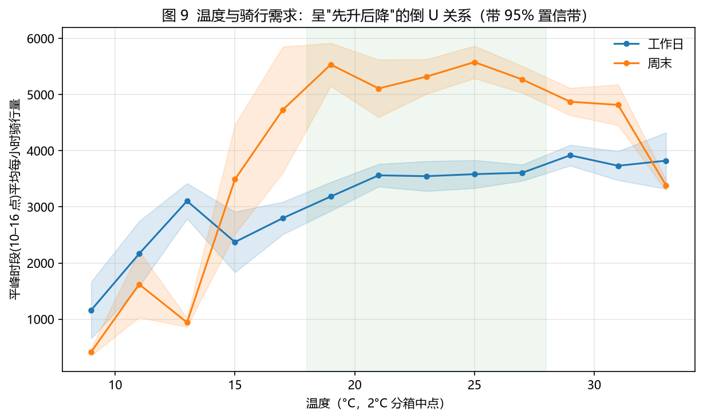

# 城市共享单车"潮汐"分析与智能调度决策支持（纽约 Citi Bike）

> **Tide & Dispatch: Data-Driven Bike-Sharing Operations Analysis (NYC Citi Bike)**
>
> A complete data-analysis + operations-decision project on 8.57 million official
> NYC Citi Bike trips (May–Aug 2019): quantify the morning/evening "tidal"
> imbalance, explain how weather drives demand (OLS, R²=0.77), forecast hourly
> demand (Random Forest, MAE≈270 bikes/h, −67% vs. naive baseline), and turn it
> into dispatch recommendations. Fully reproducible in Python.
>
> 中文完整报告见 [`docs/report.md`](docs/report.md)（含复试 5 分钟讲法与追问应对）。

## 为什么做这个项目？（Business Problem）

共享单车系统的核心成本不是车辆，而是**车放错了地方**：工作日早高峰，车辆被单向从居住区"骑"到办公区，导致早上"一边没车借、一边没桩还"。本项目把 **单车=库存、站点=门店、骑行=需求**，回答运营决策的四个问题：

1. 潮汐失衡有多严重、集中在哪些站点/时段？（**描述**）
2. 日历结构与天气如何影响需求？（**归因**）
3. 能否预测下一小时的需求量？（**预测**）
4. 何时、何地、调多少车？（**决策**）

## 核心结果（全部真实运行，可复现）

| # | 发现 | 关键数字 |
|---|---|---|
| 1 | 工作日"早 8 晚 18"双峰潮汐；周末午后单峰；年卡=通勤、临时卡=休闲 | 工作日日均 71,806 vs 周末 64,166 次（p<0.01）；周末单次时长 +23% |
| 2 | 站点级潮汐：840 站中 486 居住型 / 308 办公型；**工作日每天约 4,700 车次**单向净迁移；失衡分散（Top 100 站仅覆盖 58%） | 图 5–8、13–14 |
| 3 | 天气归因：**下雨时段需求 −41%**、雨日总量 −20%；温度倒 U（顶点 25.8°C） | OLS R²=0.773，p<0.001 |
| 4 | 小时级预测：随机森林 **MAE≈270 辆/时（约需求的 9%），较朴素基线改善 67%**；岭回归 R²=0.923、RF R²=0.956 | 图 11–12 |

> 一句话决策建议：早高峰前（5–7 点）给居住型站点补库存、白天平峰转运办公区堆积车辆腾桩、
> 雨天动态下调运力，并把逐时预测作为逐站备车的输入（详见报告 §8）。

## 数据来源

| 数据 | 来源 | 说明 |
|---|---|---|
| 骑行记录 | [Citi Bike System Data](https://citibikenyc.com/system-data)（Amazon S3 官方公开） | 2019 年 5–8 月，8,575,221 条、15 列旧版格式 |
| 气象 | [Open-Meteo 历史天气 API](https://open-meteo.com/)（基于 ECMWF **ERA5** 再分析） | 纽约中央公园，逐小时 2,952 个观测、无缺失 |

版权：数据归 Citi Bike / Lyft 与 ERA5/Open-Meteo；本仓库只含代码与聚合结果，原始文件不入库（可用脚本复现）。

## 预览（精选图，完整 14 张见 `output/figures/`）





## 仓库结构

```
citibike-tide-and-dispatch/
├── README.md                 本文件（中文主 + 英文摘要）
├── LICENSE                   MIT（发布前请替换作者名）
├── docs/
│   ├── report.md             完整中文报告（含复试讲法）
│   ├── CV_HIGHLIGHTS.md      CV 素材与岗位迁移讲法
│   ├── data_dictionary.md    字段字典 + 实测记录
│   └── ROADMAP.md            里程碑
├── src/                      Python 源码（含中文注释）
│   ├── download_data.py      Citi Bike 下载（多线程 Range/断点续传）
│   ├── clean.py              清洗流水线（规则 + 日志）
│   ├── weather_download.py   气象获取（Open-Meteo/ERA5）
│   └── viz.py                统一绘图风格
├── scripts/                  各阶段脚本（详见下方表格）
├── data/raw、data/processed  数据目录（不入库，脚本复现）
├── output/figures/           14 张结果图（入库）
└── output/results/           数值结果（入库）
```

| 脚本 | 内容 |
|---|---|
| `run_all.py` | **一键复现全流程** |
| `build_agg_tables.py` | 把 856 万行主表聚合成小时/日/站点级小表 |
| `fig01_hourly_tide.py` | 图 1：24h 需求曲线 |
| `phase3_eda.py` | 图 2–4 + 统计检验 |
| `phase3_tide.py` | 图 5–8 + 潮汐量化 |
| `phase4_weather.py` | 图 9–10 + OLS 归因 |
| `phase5_forecast.py` | 图 11–12 + 预测对比 |
| `phase6_dispatch.py` | 图 13–14 + 调度决策建议 |

## 快速开始（一键复现）

```bash
# 1) 环境（Python 3.10+）
python -m venv .venv
.venv/Scripts/python -m pip install -r requirements.txt     # Windows
# source .venv/bin/activate && pip install -r requirements.txt  # macOS/Linux

# 2) 全流程复现：下载(约 819MB，可断点续传) → 清洗 → 聚合 → 气象 → 分析 → 预测 → 决策
.venv/Scripts/python scripts/run_all.py

# 只跑部分步骤（下载过一次后可以跳过 download）
.venv/Scripts/python scripts/run_all.py --steps clean agg weather phase4 phase5
```

耗时参考（普通笔记本）：下载按带宽 5–40 分钟（多线程），清洗+各分析约 10 分钟；
结果全部输出到 `output/`。

## 许可与致谢
代码 [MIT](LICENSE)（发布前把版权行换成你的名字）；数据版权归 Citi Bike / Lyft
（[System Data 使用条款](https://citibikenyc.com/system-data)）与 ERA5/Open-Meteo。
本项目的选题与"运营管理 × 数据科学"定位，参考了共享单车再平衡（bike rebalancing）相关公开文献的思路。
