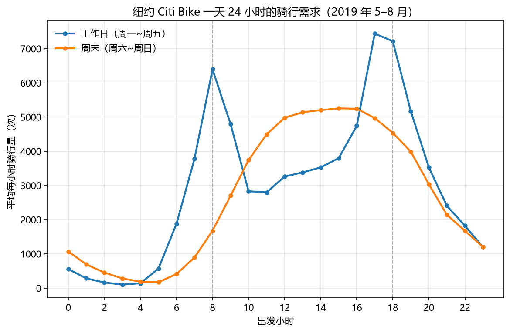

# 共享单车需求与站点流量分析

使用纽约 Citi Bike 2019 年 5—8 月骑行记录，分析一天中何时骑行量高、哪些站点在早高峰净借出较多，以及历史需求能否帮助预测下一小时的系统骑行量。

## 结果

- 清洗后保留 8,564,754 条行程，涉及 834 个唯一站点。
- 预测按时间划分训练、验证和测试；验证期选出随机森林，测试 MAE 为 278.8 次/小时，WAPE 为 8.89%。
- 站点排序反映历史净流量，用于确定优先核查库存的站点。没有库存和桩位数据，因此没有计算实际缺车率或派车数量。



## 运行

推荐 Python 3.12。在本目录创建并激活虚拟环境后执行：

```bash
python -m pip install -r requirements.txt
python scripts/run_all.py
```

首次运行下载约 819 MB 的官方年度包，仅解压 5—8 月。磁盘预留约 4 GB；清洗与聚合按块处理。已有数据时可单独运行步骤，例如：

```bash
python scripts/run_all.py --steps phase5 phase6
python -m unittest discover -s tests -v
```

## 文档

- [分析报告](docs/report.md)：数据、方法、结果和局限
- [数据说明](docs/data_dictionary.md)：来源、字段与时间口径
- [方法说明](docs/methodology.md)：净流量、预测特征与评价指标

`src/` 负责下载、清洗和绘图设置，`scripts/` 是分析入口，`output/` 保存结果。代码使用 [MIT 许可](LICENSE)，数据条款见数据说明。
