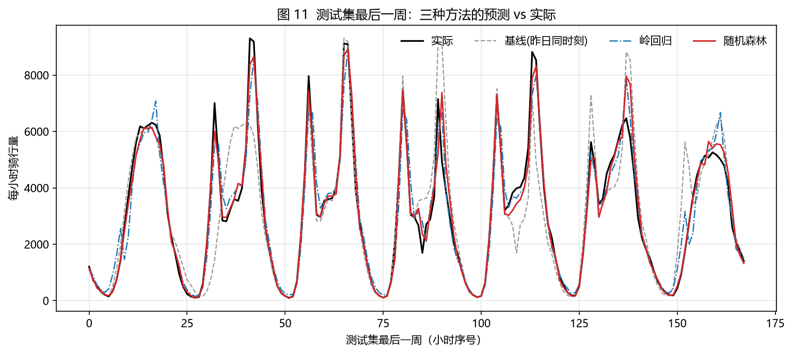
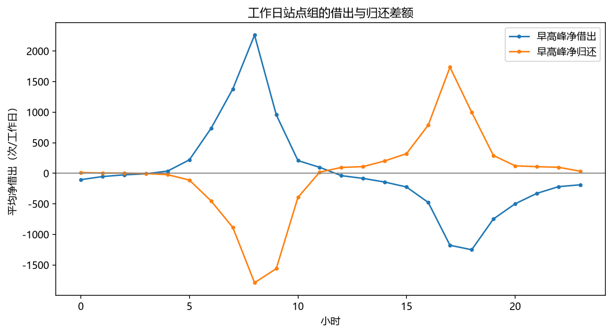

# 共享单车需求与站点流量分析

## 数据与问题

Citi Bike 2019 年 5—8 月原始记录 8,575,221 条，清洗后 8,564,754 条，覆盖 123 天、2,952 小时、834 个唯一站点。天气取自 Open-Meteo 提供的 ERA5 历史再分析。

问题包括时段差异、站点借还失衡、天气与需求的相关关系，以及下一小时系统骑行量预测。

## 方法

1. 排除时间倒置、时长不在 60 秒至 4 小时内、关键站点缺失和异常坐标记录。筛选范围为研究月份，按块读取。
2. 小时需求补齐完整日历。借出按出发时间，归还按实际结束时间；站点属性按唯一编号去重后连接。早晚净流量统一采用工作日。
3. Mann–Whitney U 检验作探索性比较；未把日期自相关或多重比较完全纳入，因此不将显著性当成稳健的业务效果证明。
4. OLS 分析天气与需求的条件相关，纳入小时、周末、温度二次项、雨和风速，采用 24 小时滞后的 HAC 标准误。雨变量系数除以全样本均值只是量级参照，不是降雨导致的百分比变化。
5. 比较昨日同时刻、岭回归和随机森林。前 60% 小时训练，中间 20% 验证，最后 20% 测试；前 168 小时用于构造滞后特征。按验证 MAE 选择方法，测试开始前用已过去的数据重拟合。

预测输入是日历、前 1/24/168 小时需求和上一小时天气。超参数固定；测试过程中每小时更新已观察到的输入。再分析数据是事后整理的天气代理，仍不能等同于当时可及时获取的观测。

## 预测结果

| 模型 | 测试 MAE（次/小时） | WAPE | R² |
| --- | ---: | ---: | ---: |
| 昨日同时刻 | 784.13 | 25.01% | 0.704 |
| 岭回归 | 407.32 | 12.99% | 0.930 |
| 随机森林 | 278.80 | 8.89% | 0.954 |

验证期 MAE 最低的是随机森林。测试期平均绝对误差为 278.80 次/小时，目标为全系统小时总量。单个站点和单个时段的误差仍需分别检验。

## 站点流量与运营解释

工作日早高峰各站借出减去归还，得到净流量。净借出较大的站点值得先核查库存；净归还较大的站点值得先核查空桩。派车数量还需结合初始库存、桩位容量和调度成本确定。

每日各站正净借出量之和用于描述借还失衡程度。它未扣除可用库存，也未考虑随后骑行带来的车辆回流。

## 局限

- 只有已完成的骑行，缺车或满桩引起的未满足需求不可见。
- 行程以研究月份的出发记录为范围，边界外出发、边界内归还的记录不在样本；首末日存在边界影响。
- 同一编号的名称或位置变化按最后出现的属性展示，没有识别站点搬迁。
- 缺少库存、容量、调度记录与调度成本，尚无法评估实际运营收益。
- 样本只有四个月、单一城市，测试区间参与过方案修订。这些结果属于探索性回测，仍需在新的时间区间独立验证。

数据链接与授权见[数据说明](data_dictionary.md)。
