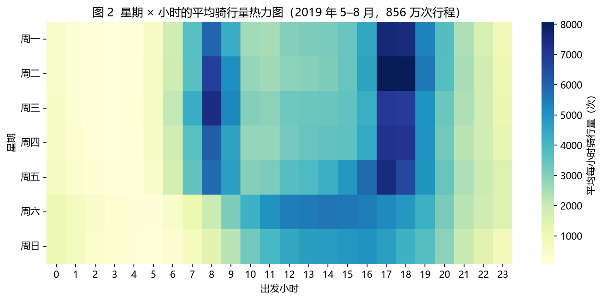
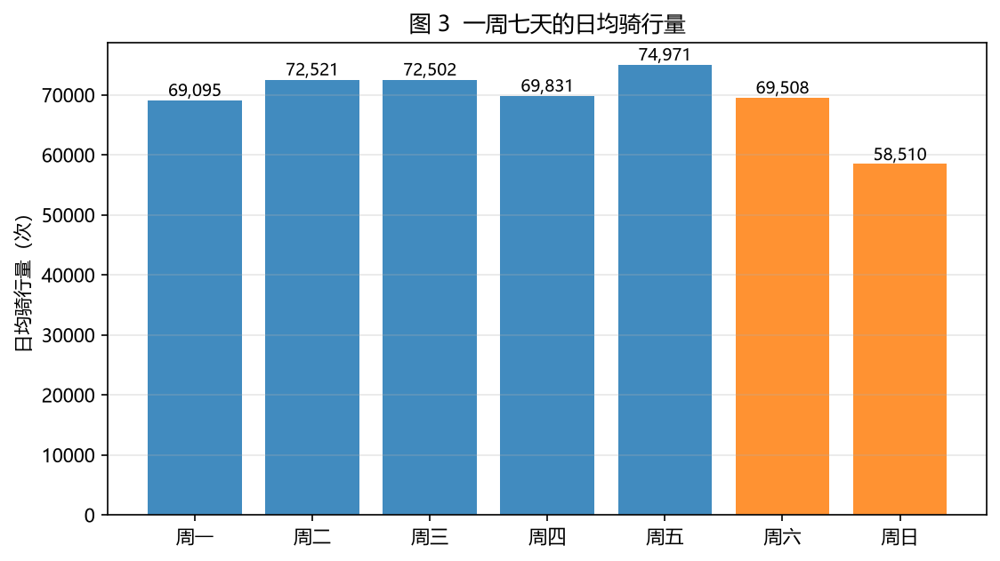
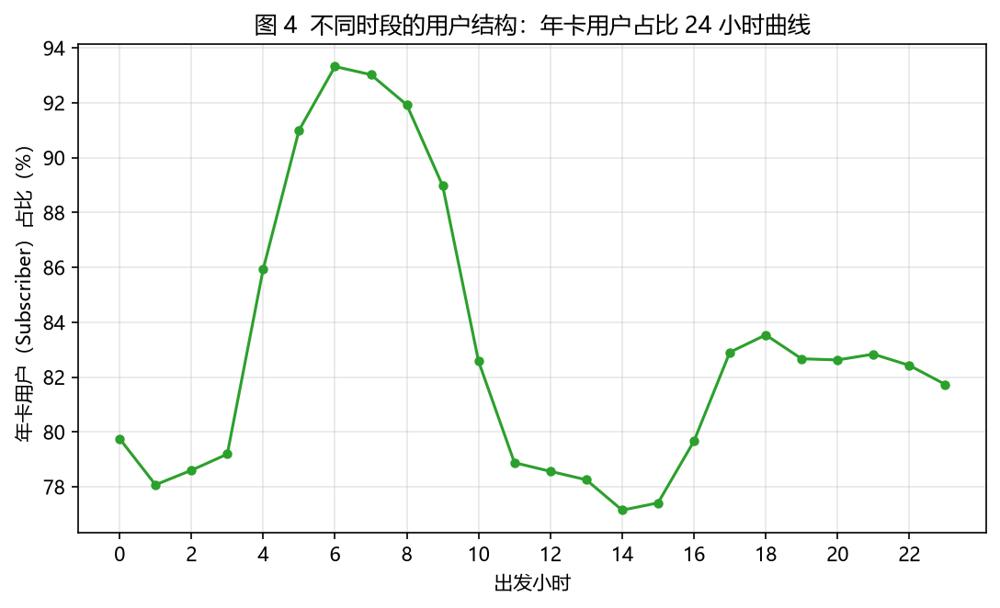
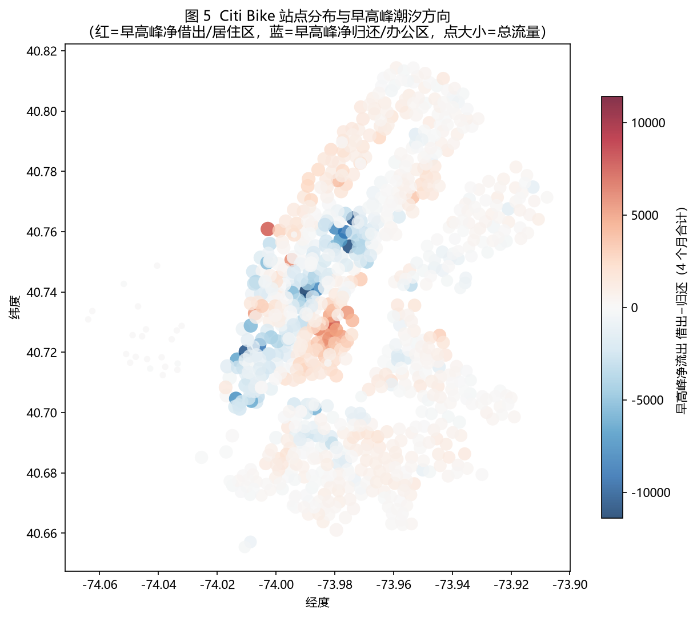
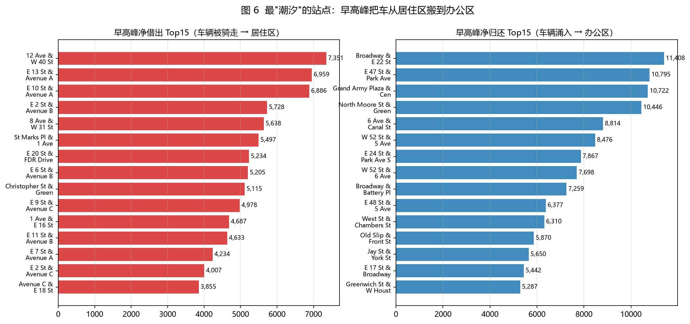
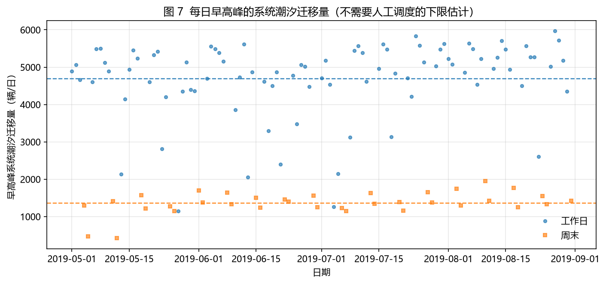
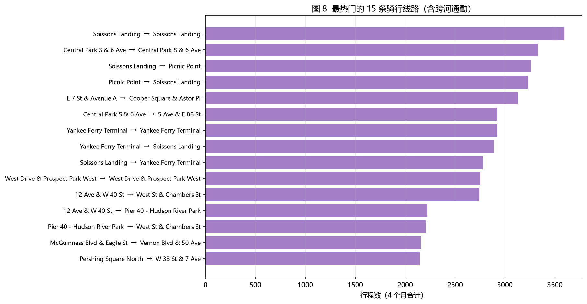
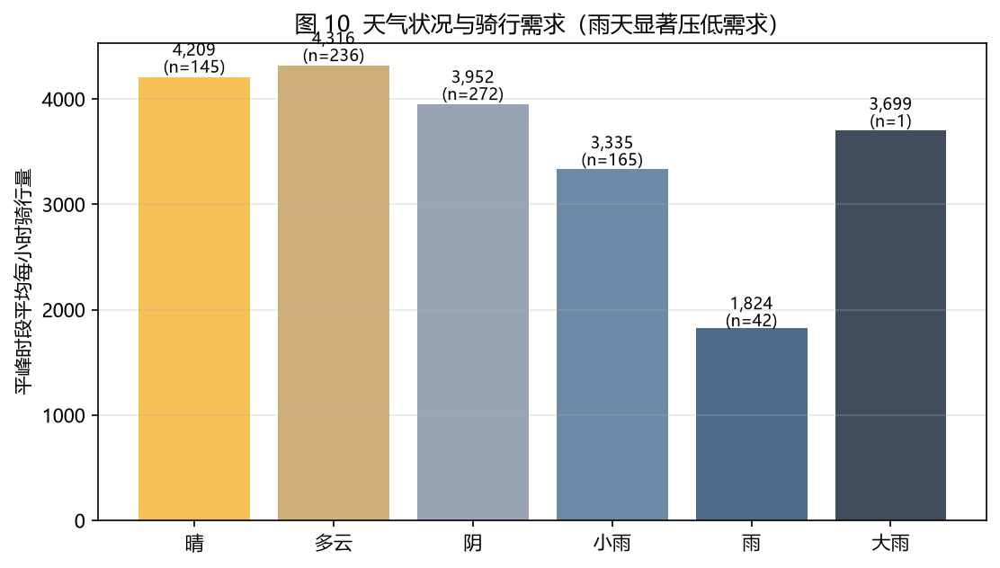
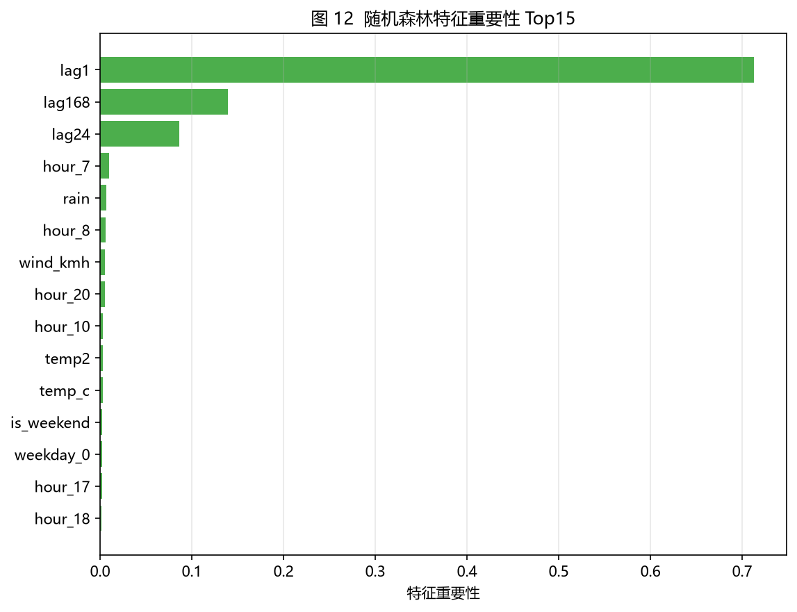
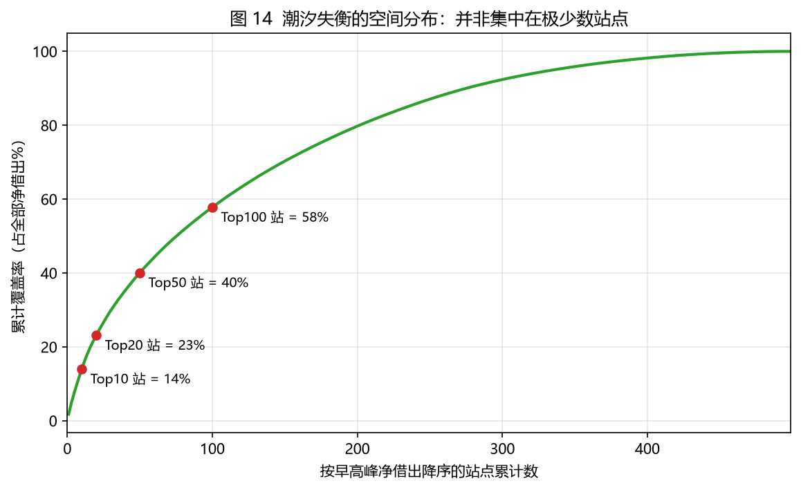

# 城市共享单车"潮汐"分析与智能调度决策支持
## —— 纽约 Citi Bike 2019 年 5–8 月实证分析（完整报告）

> 英文标题：*Tide & Dispatch: Data-Driven Bike-Sharing Operations Analysis (NYC Citi Bike)*
> 状态：报告基于真实运行结果；所有数字可由 `scripts/` 下的脚本复现。
> 建议阅读顺序：先看"一图看懂"（§0），再读各章；复试讲解用 §10 的 5 分钟讲法。

---

## 0. 一图看懂（项目摘要）

- **业务问题**：共享单车的痛点不是车少，而是**车放错了地方**——工作日早高峰，成千上万辆车被单向从居住区"骑"到办公区，导致早上"居住区无车可借、办公区无桩可还"，晚上反向再来一次。
- **数据**：纽约 Citi Bike 官方公开数据 2019-05-01 ~ 2019-08-31，共 **8,575,221** 条骑行记录（清洗后 **8,564,754** 条，保留率 99.88%）、**840** 个站点；气象数据取自 Open-Meteo 历史天气 API（基于 ECMWF **ERA5** 再分析）。
- **四个发现**（详见各章）：
  1. 工作日呈"早 8 晚 18"双峰，周末为午后单峰；年卡用户承载早晚通勤，临时用户承载周末休闲（统计检验均显著）；
  2. 早高峰存在稳定的站点级潮汐：**工作日每天约 4,700 车次**从居住型站点单向流向办公型站点，且失衡散布在上百个站点（Top 100 站仅覆盖 58%）；
  3. 需求对天气高度敏感：**下雨时段需求下降约 41%**，温度呈倒 U（18–28°C 最优，顶点 25.8°C）；
  4. 随机森林可实现**全系统小时级需求预测 MAE ≈ 270 辆/时（约平均需求的 9%），比"沿用昨日同时刻"的朴素基线改善 67%**。
- **决策建议**：早高峰前（5–7 点）给居住型站点补库存、白天平峰转运办公区堆积车辆腾桩、雨天动态下调运力；把小时级预测作为逐站备车的输入（详见 §8）。

---

## 1. 研究问题（把业务问题翻译成数据问题）

共享单车系统可以看作**分布式库存系统**：车辆=库存、站点=门店/货架、骑行=需求。运营者（调度中心）每天都要回答：

| 层次 | 研究问题 | 对应分析 |
|---|---|---|
| Q1 描述 | 用车在时空上有什么规律？"潮汐"失衡有多严重、集中在哪？ | §4、§5 |
| Q2 归因 | 日历结构与天气如何影响需求？ | §6 |
| Q3 预测 | 能否预测下一小时全系统的需求量？ | §7 |
| Q4 决策 | 何时、何地、调多少车？ | §8 |

选择共享单车而不是外卖/打车，是因为它数据公开（官方一手）、天然带空间与时间双重结构、且是**运营管理（Operations）**领域的经典问题——与商学院"智能运营/管理科学"方向高度契合。

## 2. 数据来源与预处理

### 2.1 骑行数据（一手官方）
- 来源：Citi Bike System Data（https://citibikenyc.com/system-data），托管于 Amazon S3；
- 取 2019 年（疫情前的稳定运营年 + 旧版 15 列规范格式），5–8 月共 11 个官方 CSV；
- 下载脚本 `src/download_data.py`：针对境外 S3 慢速链路实现了 **HTTP Range 多线程分段下载 + 断点续传 + 分片重试**（单连接约 100 KB/s，16 线程实测可提速约 40 倍），仅解压所需月份。

### 2.2 清洗规则（`src/clean.py`，每条规则记录剔除量）
| 规则 | 剔除 |
|---|---|
| 时间乱序（结束≤出发） | 0 |
| 时长超出 60 秒–4 小时 | 10,324 |
| 起终点站点信息缺失 | 143 |
| 经纬度越界 | 0 |
| **保留** | **8,564,754（99.88%）** |

清洗后派生时间字段（小时/星期/是否周末/时段标签），输出 `data/processed/trips_clean.csv.gz`。

### 2.3 气象数据
Open-Meteo 历史天气 API（纽约中央公园坐标，基于 ECMWF ERA5 再分析 + 站点观测同化），2952 个小时观测、无缺失；单位统一为 °C / mm / km/h；WMO 天气码映射为"晴/多云/阴/雨…"分类。脚本 `src/weather_download.py` 一键可复现。

## 3. 方法总览

| 问题 | 方法 | 工具/库 | 章节 |
|---|---|---|---|
| 时空规律 | 描述统计、热力图、假设检验（Mann-Whitney U） | pandas / scipy | §4 |
| 潮汐量化 | 站点级净流出指标、分级、累计覆盖 | pandas | §5 |
| 天气归因 | OLS（小时固定效应 + 温度二次 + 雨 + 风） | statsmodels | §6 |
| 需求预测 | 朴素基线 vs 岭回归 vs 随机森林；时间序列防泄漏切分 | scikit-learn | §7 |
| 调度决策 | 净流曲线 + 覆盖曲线（决策支持，非仿真） | pandas/matplotlib | §8 |

**设计原则**：全程不使用深度学习；模型可解释、可复述；所有验证按时间顺序切分，杜绝数据泄漏。

## 4. 发现一：时间规律与用户结构

图 1 是最直观的一张：工作日需求呈"早 8 晚 18"双峰，周末则是平滑的午后单峰。




**假设检验（Mann-Whitney U，双尾）**：

| 指标 | 工作日 | 周末 | p 值 |
|---|---|---|---|
| 日均骑行量 | 71,806 | 64,166 | 0.0011（显著） |
| 平均时长（秒） | 833（约 14 分钟） | 1,021（约 17 分钟） | 3.8e-13（显著） |





**解读**：工作日总需求更高（通勤刚需），但周末单次骑行时间更长（休闲）；年卡用户（Subscriber，多为本地通勤者）集中在 8 点与 18 点，临时用户（Customer，游客/体验者）集中于午后与周末——**同一套车，工作日是通勤工具，周末是休闲工具**，这对"周末该把车放在景点/公园站、工作日该放在通勤走廊"有直接含义。

## 5. 发现二：潮汐的量化与空间分布

**指标定义（核心，复试会被追问）**：对每个站点定义 *早高峰净流出 = 07–10 点借出数 − 07–10 点归还数*。
- 净流出 > 0：车辆被骑走 → **居住型（供给）站点**，如早晨的住宅区；
- 净流出 < 0：车辆涌入 → **办公型（需求）站点**，如 CBD。

在 840 个站点中：**486 个居住型、308 个办公型、46 个均衡**（阈值为 ±20 辆/4 个月）。







**系统级规模**：每个工作日早高峰约有 **4,696 车次**（周末 1,370）被单向从居住型站点搬到办公型站点——这是"时空错配"的规模（注：系统全天总量必然自平衡，该数字衡量的是错配量级而非净损失）。



热门线路（如连接曼哈顿中城与滨河居住区、跨河通勤线路）印证了"居住↔办公"的潮汐走廊结构。

## 6. 发现三：天气与日历对需求的归因




**回归模型**（OLS，控制小时固定效应与是否周末后）：

`需求 ~ C(hour) + is_weekend + 温度 + 温度² + 下雨(>0.2mm/h) + 风速`，**R² = 0.773**：

| 因素 | 效应 | 统计显著性 |
|---|---|---|
| 温度（倒 U） | 需求最大时 ≈ 25.8°C | p<0.001 |
| 下雨 | 每小时 **−1,197 辆 ≈ −41%** | p<0.001 |
| 风速 | −5 辆/(km/h)，纽约夏季影响小 | 不显著 |
| 周末（控制小时后） | −342 辆/时 | p<0.001 |

雨日（日降水>2mm，46 天）日均需求 **60,019** vs 无雨日 **75,375**（−20%，p<1e-9）。

**局限声明（复试务必主动讲）**：这是观察性相关而非因果；ERA5 是全城单点天气，站点级微气候未纳入；未控制节假日与大型活动。

## 7. 发现四：小时级需求预测（防泄漏的建模示范）

**建模设定（教学友好且严谨）**：
- 预测对象：全系统每小时出发量；
- 特征：日历（小时/星期/周末）+ 天气（温度及其平方/雨/风）+ **滞后需求**（lag1 上一小时、lag24 昨日同时刻、lag168 上周同时刻）；
- **防泄漏**：特征只用过去信息；按时间顺序切分（前 70% 训练、后 30% 测试），**绝不打乱**——这是与普通分类任务最大的区别，也是复试高频问题；
- 三档模型：朴素基线（直接用昨日同时刻）→ 岭回归 → 随机森林。

**测试集结果**：

| 模型 | MAE（辆/时） | RMSE | R² |
|---|---|---|---|
| 基线（昨日同时刻） | 818 | 1,408 | 0.648 |
| 岭回归 | 449 | 658 | 0.923 |
| **随机森林** | **270** | **497** | **0.956** |




**业务语言**：随机森林 MAE ≈ 270 辆/时 ≈ 平均需求的 **9%**，比朴素基线改善 **67%**——即"把昨天的需求直接当成今天的预测"有一千辆级的误差，而把日历+天气+近期趋势喂给随机森林后，绝大多数小时的偏差控制在数百辆内。深夜绝对误差小、高峰绝对误差大但相对稳定，对"提前备车"足够实用。

## 8. 决策建议：智能调度（把分析变成行动）

> 重要口径：Citi Bike 官方不公开站点实时库存与桩位容量，因此本项目的调度部分是**可被数据直接支撑的决策支持**，而非需要库存假设的精确仿真——这一点在复试中主动说明反而加分。




**建议一（调度窗口）**：居住区站点 8:00 前后被抽空最猛，补车/保库存的投放窗口应在 **5:00–7:00** 完成；办公区站点 8:00 前后被灌满、桩位承压，白天平峰可安排转运腾桩。晚高峰（17 点起）潮汐自行反向，说明**总量不缺车，缺的是正确时点、正确站点的库存**。

**建议二（优先级）**：Top 10/20/50/100 站分别只覆盖净借出的 14%/23%/40%/58%——失衡分散在上百个站点，不能只盯少数大站。这恰恰说明**逐站逐时预测（阶段五）比"固定站点清单"更值得投入**。

**建议三（天气联动）**：下雨时段需求下降约 41% → 雨天动态下调调度频次与投放量，把运力留给晴好工作日的早高峰窗口；高温回落后的傍晚也是高需求时段（图 9）。

**建议四（把预测接进运营）**：随机森林小时级预测 MAE≈270 辆/时，可直接作为"预调度量"的输入；未来引入站点库存/桩位数据后，可在同一框架上用线性规划最小化调度成本（本文的净迁移量作为约束右端项），得到逐站逐时派车方案。

## 9. 局限与未来工作

1. **无库存/桩位数据**：所有"缺车"推断都基于净流量的量级与方向，无法精确仿真"缺车时长"；
2. **单点天气**：ERA5 全城平均，未区分站点微气候；
3. **预测为系统级**：站点级预测仅论证了可行性框架，未逐一建模（可作为扩展：对 Top 潮汐站分别训练）；
4. **时间范围**：仅覆盖夏季 4 个月，未覆盖冬季（雪/冰对骑行的影响会更极端）；
5. **观察性分析**：天气归因是相关关系，非随机实验。

未来方向：接入库存/桩位数据做调度优化；扩展到全年与多城市（Divvy/共享单车可比对）；把价格/激励（需求侧管理）纳入讨论——"用数据让车流向正确的地方"，而不只是"用卡车把车搬到正确的地方"。

## 10. 复试 5 分钟讲法（建议背熟）

> **开场（20 秒）**："共享单车系统最贵的不是车，是车放错了地方。我把单车看成库存、站点看成门店，用纽约 Citi Bike 官方 856 万条骑行记录回答一个问题——调度中心每天早上该往哪些站点补多少车。"
>
> **数据（30 秒）**：官方一手数据 2019 年 5–8 月，857 万条、840 站，清洗保留 99.88%；气象用 Open-Meteo（ERA5 再分析）逐小时对齐。
>
> **方法（1 分钟）**：四步——描述（发现早 8 晚 18 双峰潮汐）→ 归因（OLS 量化天气：下雨 −41%、温度倒 U）→ 预测（随机森林，强调**按时间切分防泄漏**，MAE 270 辆/时、较基线改善 67%）→ 决策（调度窗口 5–7 点投放、平峰转运、雨天减运力）。
>
> **两张王牌图**：图 1（双峰曲线）+ 图 13（净流曲线），都指向"时空错配"。
>
> **收尾（30 秒）**：主动讲局限——没有站点库存数据所以给的是决策支持而非仿真；下一步想做库存约束下的调度优化，并说明为什么这类问题属于运营管理/智能决策的范畴。

### 10.1 高频追问应对
1. **"数据是真实的吗？"**——官方 System Data 页面公开下载，脚本可复现；清洗剔除量逐条记录。
2. **"什么叫数据泄漏？你怎么防的？"**——用未来信息训练；本项目滞后特征全部来自过去、按时间顺序切分、不做随机打乱。
3. **"为什么用随机森林而不用 LSTM？"**——856 万行聚合到小时级后样本约三千个，树模型够用且特征重要性可解释；深度学习样本量不占优，也不利于讲清机理。
4. **"预测 9% 的误差在业务上算什么水平？"**——MAE 270 辆/时，对应调度几辆卡车的决策粒度；相比"直接用昨天"的 818 辆误差有明显改善。
5. **"结论能推广到国内共享单车吗？"**——方法可迁移；国内单车多、潮汐更强、无桩模式让"桩位"约束变成"违停治理"，是另一个有趣问题。
6. **"你最大的局限是什么？"**——没有站点级库存/桩位数据，所以量化的是错配量级而非精确缺车时长（见 §9）。

## 11. 复现指南

```bash
python -m venv .venv
.venv/Scripts/python -m pip install -r requirements.txt        # Windows
.venv/Scripts/python scripts/run_all.py                        # 全流程一键复现
# 或分步：
#   download -> clean -> agg -> weather -> eda -> tide -> phase4 -> phase5 -> phase6
```

输出：图表在 `output/figures/`（14 张），数值结果在 `output/results/`（模型对比、回归摘要、检验、调度摘要等）。

*数据版权归 Citi Bike / Lyft 与 ERA5 数据提供方所有，本项目仅用于学习展示。*
