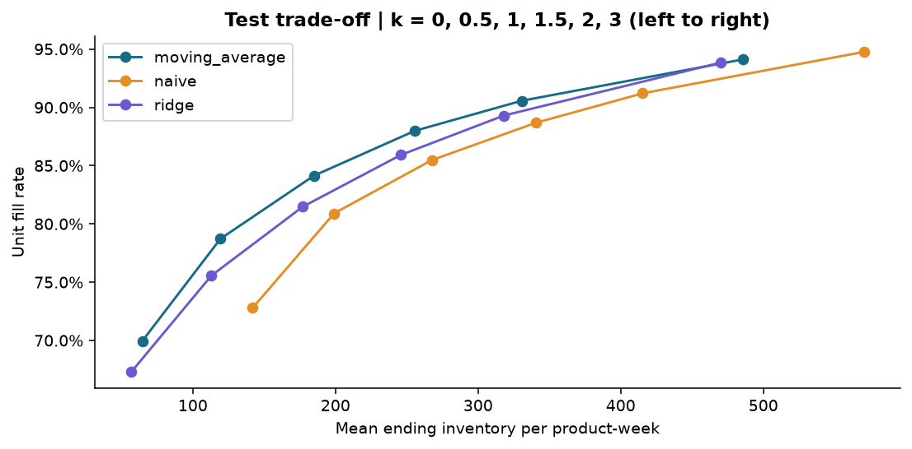

# 零售销量预测与库存仿真

使用 UCI Online Retail II 交易记录，比较简单销量预测，并在给定交期和成本假设下模拟每周补货，观察库存占用与缺货之间的权衡。

## 结果

<!-- RESULTS_START -->

- 数据：1,067,371 条原始交易，25 个常销商品，104 个完整周。
- 预测：四周移动平均测试 WAPE 为 48.79%，较上周销量基准降低 21.0%。
- 库存：基础情景下，验证期选出的补货策略在测试期的成本，相较于移动平均、k=1 的基准上升 15.5%。
- 成本以仿真假设单位计量，参数与结果见[分析报告](docs/analysis_report.md)。

<!-- RESULTS_END -->



## 运行

推荐 Python 3.12。在本目录创建并激活虚拟环境后执行：

```bash
python -m pip install -r requirements.txt
python run_analysis.py
python -m unittest discover -s tests -v
python scripts/verify_outputs.py
```

首次运行会下载约 44 MB 的 UCI 数据。参数在 `config.json`，包括商品数、时间划分和成本情景。Notebook 的额外依赖见 `requirements-notebook.txt`，安装后可运行 `python scripts/execute_notebook.py`。

## 文档

- [分析报告](docs/analysis_report.md)
- [方法说明](docs/methodology.md)
- [数据来源](data/README.md)
- [Notebook](notebooks/01_exploration.ipynb)

`src/` 为分析实现，`outputs/` 保存结果。库存、采购和交期并非数据中的真实记录，成本结果只代表设定情景。代码采用 [MIT 许可](LICENSE)，原始数据采用 CC BY 4.0。
