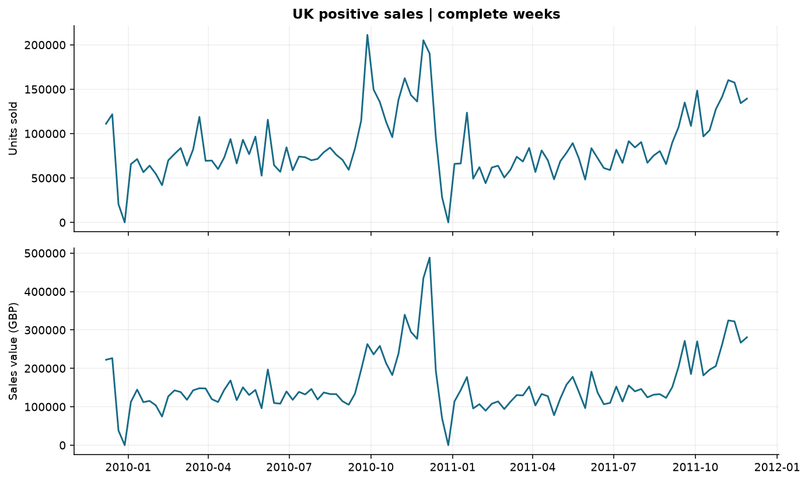
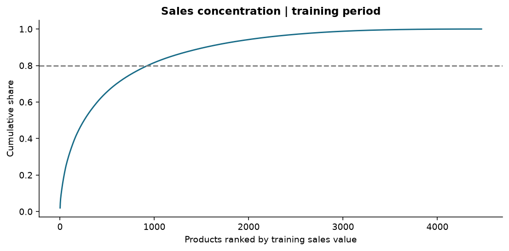
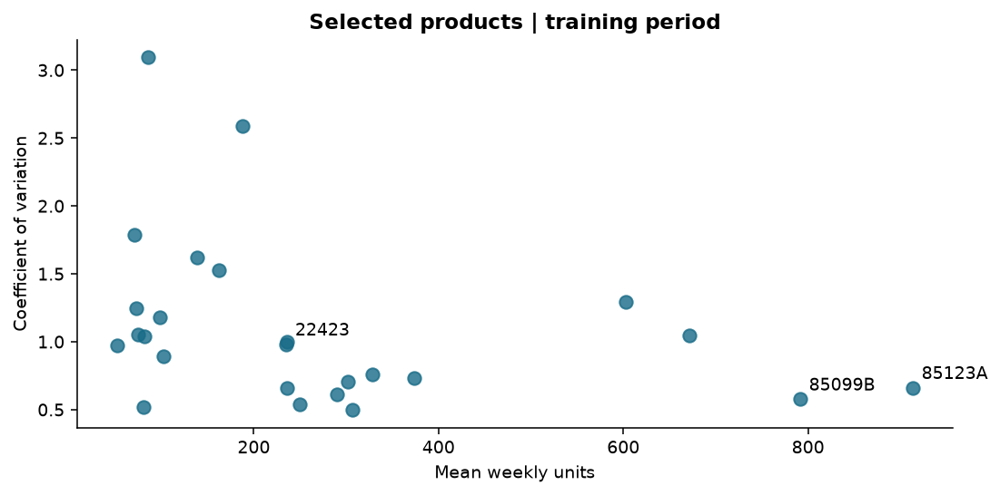
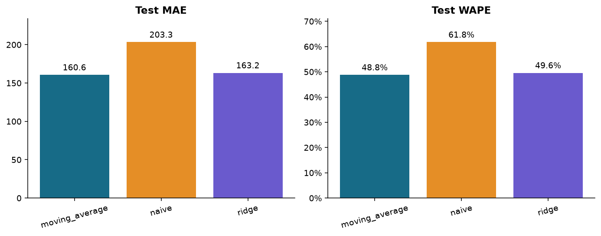
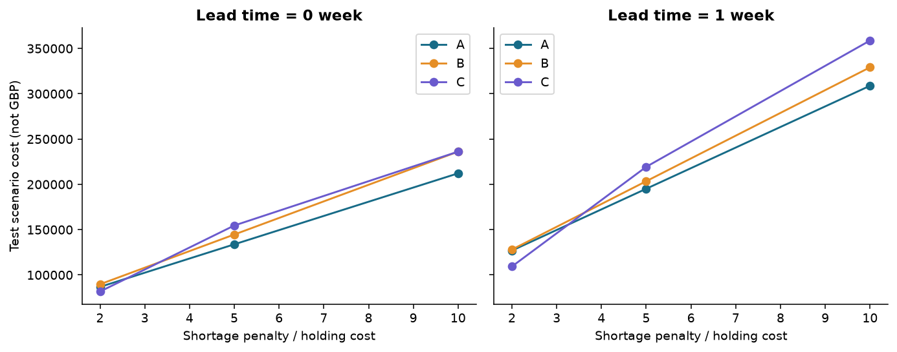

# 分析报告：零售销量预测与库存决策仿真

## 研究问题
能否用简单销量预测辅助每周补货？预测误差改善是否转化为更低库存成本？

## 数据与样本
原始 1,067,371 行；清洗及完整周筛选后 925,987 行。研究 United Kingdom 市场，选取训练期活跃周占比至少 80% 的高销售额商品，共 25 个。周度区间 2009-12-07 至 2011-11-28，共 104 周。

来源：Chen, D. (2012), Online Retail II, UCI，https://doi.org/10.24432/C5CG6D 。数据采用 CC BY 4.0。
清洗保留客户编号缺失和疑似重复记录，避免在证据不足时删掉有效销量；取消/负数量、非正价格和不匹配五位数字加可选字母的商品代码被排除。代码规则可能漏掉有效特殊商品。异常批发大单保留，均值和回归可能受其影响。详见 data_quality.json。

## 经营分析
训练期有 4,467 个商品，其中销售额最高的 929 个（占 20.8%）贡献了至少 80% 的正向销售额。所选 25 个常销商品贡献 13.6%，训练期销量变异系数中位数为 0.98。高活跃度并不意味着销量稳定。

经营含义：可优先对高贡献商品建立补货监控，但这些商品的波动水平仍有差异。销售额没有扣采购成本，不能据此排列盈利能力。年末零销量周可能与营业或记录状态有关，此数据不足以判定原因。

## 验证设计
训练期截至 2011-06-20（不含），随后 12 周验证、最后 12 周测试。测试区间 2011-09-12 至 2011-11-28（周一标签）。每阶段开始时拟合各商品岭回归，阶段内参数固定，但每周特征更新为已经观察到的实际销量。alpha=10.0 预先固定；负预测截为零。没有使用随机切分。

安全库存尺度是每阶段开始前 12 周销量标准差，并非已校准的预测区间；k 不对应正态分布服务概率。C 策略按各成本/提前期场景的验证成本选择模型和 k，测试期锁定。

## 预测结果
| 模型 | MAE（件/商品周） | WAPE |
|---|---:|---:|
| moving_average | 160.65 | 48.79% |
| ridge | 163.25 | 49.58% |
| naive | 203.31 | 61.75% |

本次测试 WAPE 最低的是 moving_average。移动平均相对朴素预测的 WAPE 降幅为 20.98%。此为测试表现描述，不用它重新选择 C 策略，也没有据此声称统计显著性。

## 库存决策结果
基础情景：提前期为零，单位期末库存每周成本设为 1，单位缺货惩罚设为 5。成本是归一化情景单位，不是英镑。A=移动平均、k=1；B=岭回归、k=1；C=验证集选择。

| 策略 | 模型 | k | 平均期末库存/商品周 | 数量满足率 | 情景总成本 |
|---|---|---:|---:|---:|---:|
| A | moving_average | 1 | 184.83 | 84.13% | 133,805 |
| B | ridge | 1 | 177.00 | 81.47% | 144,615 |
| C | ridge | 0.5 | 113.03 | 75.57% | 154,574 |

C 相对 A 的测试情景成本上升 15.52%。选择结果为 ridge、k=0.5。应结合满足率和库存占用解释，而不能只看成本。

验证期平均销量为 246.42 件/商品周，测试期为 329.24，变化 +33.6%。这说明两阶段需求水平不同；只能作为外推风险的描述证据，不能断言它独自导致策略表现变化。验证期适合的安全库存参数没有得到测试期收益保证。

## 管理解释与局限

- 固定安全库存比较 A/B 主要观察预测方法差异；A/C 同时包含方法与参数选择差异，不能归因于单一因素。
- 1 周提前期使用两周平坦需求预测以及平方根时间缩放，仅为简化情景。不同周误差可能相关，缩放未得到统计校准。
- 所有策略从空库存和空在途开始；提前期为 1 时第一周必然缺货。跨提前期比较包含这一启动效应，不能解释为纯提前期因果效应。
- 销量作为外生需求代理，即使模拟缺货仍可观察历史销量；这相当于有外部需求记录的回放实验，真实业务中缺货会遮蔽需求。
- 无交易周视为零，没有真实营业、缺货与停售状态；没有采购成本、仓储容量、最小订货量、退货再入库或供应限制。
- 每件商品使用相同成本假设，未体现商品价值差异；期末库存没有清算或残值处理，在途库存只记录、不计持有成本。
- 测试期只有 12 周，不能覆盖全年泛化表现；没有统计显著性或因果效果声明。
- 训练期常销高贡献样本存在明确适用范围：不代表新品、长尾商品或中国当前零售市场。

## 建议
先建立简单规则基准，按缺货代价选择安全库存，再检查复杂一点的预测是否带来额外价值。上线前必须补充真实库存、交期和成本信息，并跨季节回测。
