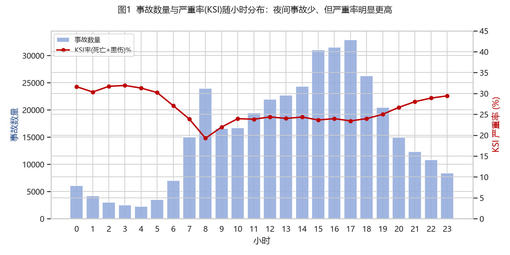
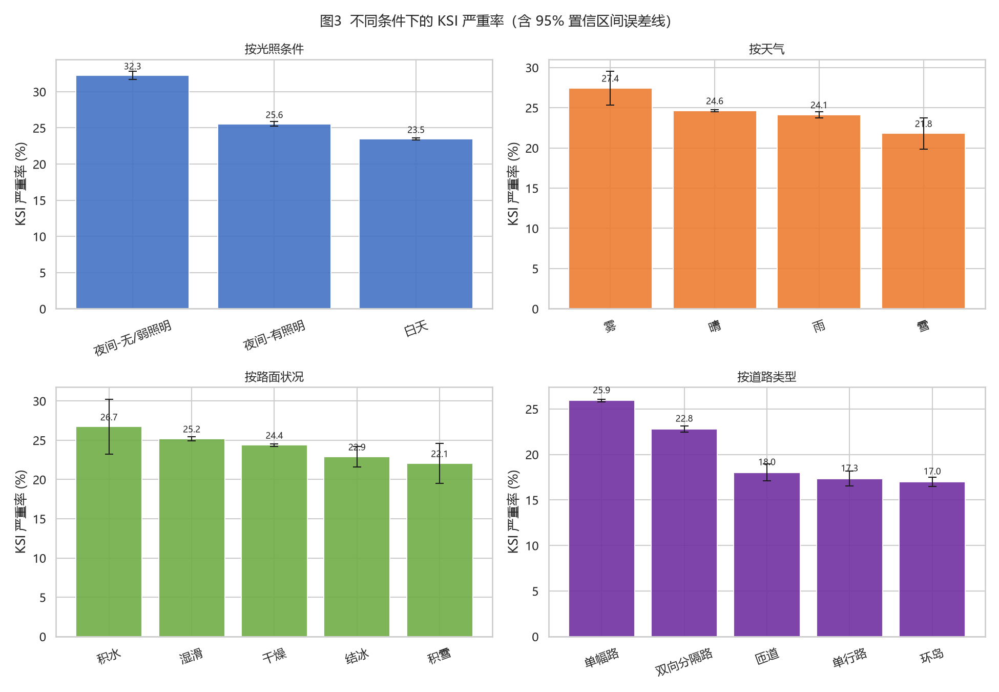
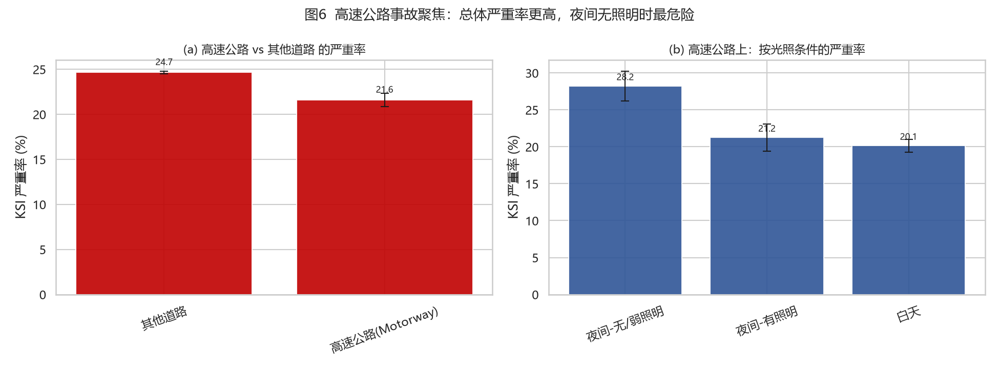

# 道路交通事故严重性风险分析：从数据到主动预警决策

> *Data-driven road accident severity analytics & proactive warning decisions*

> 用公开事故数据回答一个问题：**什么样的"时间 × 环境 × 路段"情景下，事故一旦发生就更可能造成死亡或重伤？** 并据此给出可解释的风险评分与"绿/黄/红"主动预警规则，为高速公路等场景的预警设施布设提供数据支撑。

这是一个面向 **数据分析 + 管理决策** 的完整 Python 项目（非深度学习/非黑箱）：统计推断 → 可解释逻辑回归 → 决策支持清单，全程本科生可以复述的统计学与回归方法。

---

## 1. 背景与动机

2023 年"梅大高速"、2024 年"丹宁高速"等重大事故暴露出一个共性痛点：

- 高速行驶下，一旦前方突发险情（塌方、事故、恶劣条件），**后方来车很难第一时间获知**；
- 幸存司机只能用双闪、手势预警，后车看到后往往**来不及刹停**，极易引发二次事故；
- **夜间尤甚**——本项目数据同样显示夜间事故的严重率显著更高。

一种被反复讨论的解决方案是在重点路段布设**联网的太阳能红黄绿提示灯**（绿灯畅通 / 黄灯减速 / 红灯险情），让司机或交警可以一键把险情推送给几公里内的后车。但一个现实的管理问题是：

> **提示灯数量有限、成本不低——应该优先布在哪里？什么条件下触发哪一档预警？**

本项目不直接造灯，而是用英国交通部（DfT）2021–2024 年 **37.8 万起** 真实事故记录回答这个"先布哪里、何时预警"的决策问题：识别严重事故（KSI，死亡或重伤）高概率的**情景画像**，把预警资源投向这些画像对应的路段与时段。

> ⚠️ 数据为英国 STATS19 警察上报事故。方法可直接迁移到中国场景，结论需用本地数据校准（详见 [局限](#9-局限与诚实声明)）。

## 2. 研究问题

| # | 问题 | 对应方法 |
|---|---|---|
| R1 | 事故严重程度在时间/光照/天气/道路/限速上如何分布？ | 探索性分析 EDA |
| R2 | 各情景因素与"死亡/重伤"是否独立？关联多强？ | 卡方检验 + Cramér's V |
| R3 | 控制混杂后，哪些**可预警/可干预**因素独立提高严重概率？效应多大？ | 逻辑回归（OR + 95%CI） |
| R4 | 如何把模型变成管理工具：风险排序、布设优先级、红黄绿触发规则？ | 决策支持清单 |

## 3. 数据

- **来源**：英国交通部 DfT [Road Safety Data](https://www.data.gov.uk/dataset/cb7ae6f0-4be6-4935-9277-47e5ce24a11f/road-accidents-safety-data)（STATS19，警察上报的人身伤亡碰撞事故），OGL v3.0 开放许可。
- **文件**：`https://data.dft.gov.uk/road-accidents-safety-data/dft-road-casualty-statistics-collision-{year}.csv`
- **样本**：2021–2024 四年，原始 412,276 起 → 剔除关键变量缺失/不明后 **377,808 起**；另含 2025 初步数据（覆盖不全，未纳入主分析）。
- **关键变量**：碰撞严重度（1=死亡/2=重伤/3=轻伤）、光照、天气、路面、道路类型、限速、城乡、是否高速(Motorway)、经纬度、时刻等。
- **下载**：`python scripts/download_data.py`（自动复现，原始 csv 不入库）。

> 每个数字编码都按 DfT 官方字典翻译成可读标签（见 `01_clean.py` 注释），清洗口径可复核。

## 4. 方法与流程

```
scripts/download_data.py   从 DfT 官方源下载 2021-2025 事故主表
scripts/01_clean.py        清洗 + 特征工程 → data/processed/accidents_clean.csv.gz
scripts/02_eda.py          描述统计与 8 张图（含 95% CI 误差线）→ output/figures
scripts/03_inference.py    卡方独立性检验 + Cramér's V + 两比例 z 检验
scripts/04_model.py        逻辑回归：OR / 95%CI / ROC-AUC / 风险分层
scripts/05_decision.py     风险情景 Top 榜、高速专项、红黄绿规则表
```

或一键运行：`python scripts/run_all.py`（见 [快速开始](#6-快速开始)）。

**用到的方法**（都可在本科《概率论与数理统计》《应用回归分析》中找到）：

1. **比例区间估计**：`p ± 1.96·√(p(1-p)/n)` 画严重率误差线；
2. **卡方独立性检验** `χ² = Σ(O-E)²/E` + **Cramér's V** `V = √(χ²/(n·(min(r,c)-1)))`；
3. **两比例 z 检验**（夜间 vs 白天严重率差异）；
4. **二元 Logistic 回归**（MLE），用**比值比 OR = e^β** 解释每个因素的效应，附 95% CI；
5. **风险分层校验**：把预测概率分十档，看"预测越高、实际严重率越高"是否单调。

## 5. 主要结果

### 5.1 谁更危险？（EDA + 单因素，37.8 万起事故）

| 维度 | 发现 |
|---|---|
| 光照 | **夜间无/弱照明 KSI 率 32.3%**，白天仅 23.5%（差 8.8 个百分点，z=32.7，p<0.001） |
| 城乡 | 乡村 29.4% vs 城市 22.1% |
| 小时 | 事故量"早晚高峰双峰"，严重率却在**凌晨更高**（事故少但更致命） |
| 月度 | 冬春严重率偏高（暗、湿、冰） |
| 限速 | 限速越高严重率越高（图 4） |
| 年度 | 2021→2024 事故总量下降，但 KSI 率 23.2% → 25.7% 持续上升（口径变化需谨慎，见局限） |





### 5.2 控制混杂后，谁独立地更危险？（逻辑回归 OR）

以 **白天 / 晴 / 单幅路 / 城市** 为基准，控制其他变量后：

| 因素（相对基准） | OR | 含义 |
|---|---|---|
| 夜间有照明（vs 白天） | **1.25** | 严重概率发生比 +25% |
| 夜间无/弱照明（vs 白天） | **1.17** | +17% |
| 乡村（vs 城市） | **1.19** | +19% |
| 限速每 +10 mph | **1.14** | 累计 +14% |
| 周末（vs 工作日） | 1.04 | +4% |
| 高速公路 Motorway（vs 其他） | **0.71** | **-29%**（见下） |
| 雨天/雾天/雪天（vs 晴） | 0.90 / 0.88 / 0.72 | 反而更低（讨论见报告） |
| 涉事车辆每 +1 | 0.78 | 单车/两车更致命 |

**两个反直觉但重要的发现**（报告第 5 节有完整解释）：

1. **高速公路单起事故的 KSI 比例反而较低（OR=0.71）**——但一旦出事"规模"大得多：多车连环（≥5 车）占比 3.2%（其他道路的 **6 倍**），一次伤亡 ≥3 人占比 12.6%（其他道路的 **2.3 倍**）。**这恰恰是"高速必须主动预警、防二次事故"的理由**：风险不在"事故更容易致命"，而在"一次事故拖入更多车、更多人"。
2. **雨雾雪天严重率反而更低**：恶劣天气下车速普遍降低、事故多为低速碰擦；且单因素里雾天严重率最高（27.4%），控制道路/照明后翻转——**单因素与多因素结论可以不同**，这就是"控制混杂"的意义（方法论示范点）。

模型排序能力：测试集 **ROC AUC ≈ 0.60**，风险分层图显示预测与实际的严重率基本单调。AUC 不高是诚实的信号：**情景变量解释力有限**，严重性还取决于碰撞角度、相对速度差、车辆安全配置等不可观测因素——所以本项目把它定位为"风险排序/资源布设工具"，而非事故鉴定器（见局限）。

### 5.3 管理决策产出（`05_decision.py`）

**高危情景 Top（两车、工作日）**——预警设施应优先覆盖的画像：

| 排名 | 情景 | P(KSI) |
|---|---|---|
| 1 | 夜间有照明 · 晴 · 乡村单幅路 · 60mph | 37.9% |
| 2 | 夜间无/弱照明 · 晴 · 乡村单幅路 · 60mph | 36.3% |
| 3 | 夜间有照明 · 雨 · 乡村单幅路 · 60mph | 35.6% |
| … | 完整 20 名见 `output/tables/risk_scenario_ranking.csv` | |

**红黄绿三档预警规则**（按历史风险分位数，映射老爹方案中提示灯的工作模式）：

| 档位 | 触发条件（预测 P(KSI)） | 行动建议 |
|---|---|---|
| 🟢 绿灯 | P < 22% | 正常通行 |
| 🟡 黄灯 | 22% ≤ P < 28% | 黄灯减速提示、保持车距广播 |
| 🔴 红灯 | P ≥ 28% | 建议管制/分流/封闭，配套巡查与应急值守 |

示例触发场景：**夜间 + 乡村高限速单幅路（P≈38%）** → 建议常态化黄灯、夜间可升级红灯级主动提示。完整表见 `output/tables/warning_rules.csv`。

> 提醒：预测的是"已发生事故属于 KSI 的条件概率"，不是"会不会发生事故"。做**实时事故预警**还需要事件/流量数据；本项目用它回答"**高风险情景识别 → 预警资源布设优先级**"，是对方案的数据化第一步（报告第 7 节有更细的落地讨论）。

## 6. 快速开始

```bash
# 1) 环境：Python 3.10+（开发于 3.12）
pip install -r requirements.txt

# 2) （可选）重新下载原始数据（约 100 MB，含 2025 初步数据；仓库内已提供清洗产物）
python scripts/download_data.py --years 2021 2022 2023 2024

# 3) 一键复现全部分析与图表
python scripts/run_all.py
```

产物：图 → `output/figures/`（12 张），表 → `output/tables/`（8 份），清洗数据 → `data/processed/accidents_clean.csv.gz`。

## 7. 目录结构

```
road-safety-risk-analysis/
├── README.md                  # 本文件
├── ANALYSIS_REPORT.md         # 中文分析报告（含复试讲稿要点与 Q&A）
├── requirements.txt
├── LICENSE                    # MIT（代码）；数据为英国 OGL v3.0
├── scripts/                   # 01 清洗 → 05 决策 的完整流水线
│   ├── download_data.py
│   ├── 01_clean.py / 02_eda.py / 03_inference.py / 04_model.py / 05_decision.py
│   └── run_all.py
├── data/
│   ├── raw/                   # 原始 csv（gitignore，脚本下载）
│   └── processed/accidents_clean.csv.gz   # 清洗后主分析表（入库）
└── output/
    ├── figures/               # fig1 - fig12
    └── tables/                # 统计汇总 / 检验结果 / 模型参数 / 决策表
```

## 8. 为复试准备：30 秒讲清这个项目

> "我用英国交通部 2021–2024 年 37.8 万起道路事故数据，研究**什么情景下事故一旦发生更容易造成死亡或重伤**。先用卡方检验和 Cramér's V 发现夜间无照明、乡村高限速等与严重性显著相关；再用逻辑回归控制混杂，得到每个因素的比值比——比如夜间无照明让严重概率提高约 17%；最后把模型转成决策工具：生成高风险情景榜单和红黄绿三档预警规则，回答'主动预警灯应该优先布在哪里、什么条件触发哪一档'。这个思路可以支持高速公路二次事故预警这类真实场景。局限也很清楚：英国警察上报数据、横截面只能谈相关、AUC 0.60 说明情景变量解释力有限。"

更完整的讲稿（研究问题→数据→方法→结果→局限→可能被追问的问题）见 [`ANALYSIS_REPORT.md`](ANALYSIS_REPORT.md)。

## 9. 局限与诚实声明

1. **数据地域**：英国 STATS19（警察上报），非中国数据。方法可迁移，结论（尤其高速/乡村道路结构）需用中国本地数据校准；交通规则与道路设计（如英国单幅路 60mph）与中国不同。
2. **上报偏差**：仅含"上报给警察、涉及人身伤亡"的事故；轻伤上报完整度逐年变化，可能部分解释 KSI 率上升趋势。
3. **相关 ≠ 因果**：横截面观测 + 逻辑回归只能谈"关联/条件风险"，不能断言因果（例如"路灯导致事故更严重"是错误解读）。
4. **AUC ≈ 0.60**：情景变量只解释一部分严重性差异；模型适合**风险分层与排序**，不适合高精度个体预测。
5. **无暴露量**：本分析以"已发生的事故"为条件，不能回答路段"事故率/风险暴露"（需车流量数据），故布设优先级应结合 DfT traffic counts 或国内流量数据再落地。
6. **红黄绿阈值**为按风险分位数的演示性规则，实际阈值应由管理部门按可接受风险校准。

## 许可

- 代码：MIT License。
- 数据：UK Open Government Licence v3.0（[说明](https://www.nationalarchives.gov.uk/doc/open-government-licence/version/3/)），使用时请保留 DfT 来源说明。
