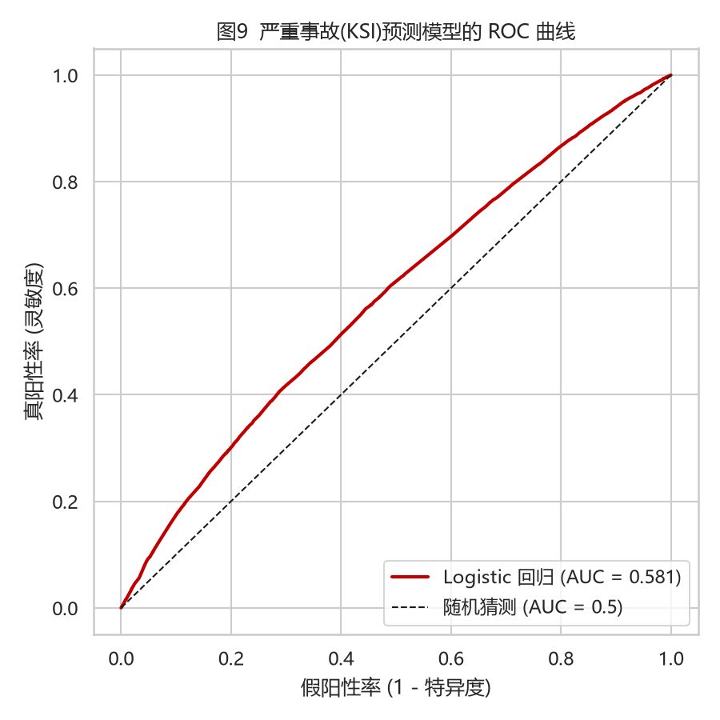

# 道路交通事故严重性分析

## 研究范围

数据是警察记录的人身伤亡碰撞事故，一行代表一起事故。目标为该事故是否包含死亡或重伤（KSI），不是道路是否将发生事故。

2021—2024 年官方事故表共 411,883 行，清洗后保留 372,578 行。数据获取日期为 2026-09-09，源文件哈希和清洗计数见 [data_quality.json](../output/tables/data_quality.json)。

## 统计与模型

分组严重率给出样本数和比例区间；卡方检验同时报告 Cramér's V，避免把大样本显著性等同于强关联。事故之间可能存在空间和时间相关，常规标准误未完全处理这类相关。

逻辑回归使用光照、天气、道路类型、城乡、限速、Motorway 标志、周末和时段。涉车数与伤亡人数发生在事故之后，只用于描述，不进入预测模型。OR 是条件胜算比，不能直接解释成风险增加百分比或干预效果。

2021—2023 年 281,113 起事故拟合，2024 年 91,465 起事故测试。模型结构固定，不通过测试集选择变量。

| 测试指标 | 数值 |
| --- | ---: |
| ROC AUC | 0.5814 |
| Average precision | 0.3187 |
| 测试 KSI 占比 | 25.77% |
| Brier score | 0.1883 |
| 用训练 KSI 均值预测的 Brier | 0.1915 |

AUC 接近 0.5，模型的区分能力较弱；Brier score 相比常数预测仅有小幅改善。

## 历史情景与分层

情景清单仅包含训练期真实出现且至少有 200 起事故的特征组合，保留数量、实际严重率与模型评分。它可提示值得进一步查看的记录，不能直接决定设施布设优先级；后者还需要暴露量、地点信息和干预成本。

用训练期评分的 50% 和 80% 分位数设分组边界，在 2024 年检验：

| 分组 | 测试事故数 | 平均预测严重率 | 实际严重率 |
| --- | ---: | ---: | ---: |
| 较低 | 44,877 | 19.76% | 21.34% |
| 中间 | 27,254 | 25.28% | 26.68% |
| 较高 | 19,334 | 33.41% | 34.75% |

分层用于比较历史记录的条件严重率，适合作为进一步分析的线索。多车辆事故另按涉车数不少于 5 辆统计；数据未提供碰撞顺序，无法识别连环追尾或二次事故。

## 局限

- 没有未发生事故的对照和行驶里程，无法估计路段事故发生率。
- 仅使用警方原始严重度，没有应用伤情报告制度调整；跨年份差异可能部分来自统计制度变化。
- 排除未知照明、部分天气及道路类别会影响样本代表性；新版道路类型 12 未纳入当前分组。
- 模型遗漏驾驶行为、车辆等因素，观察性关系不支持因果推断。
- 英国记录不直接支持中国路段的管理决策，模型尚无独立外部验证。

来源和编码见[数据与方法](methodology.md)。
